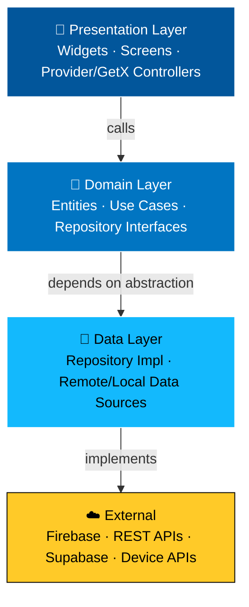

<div align="center">


I build production-grade cross-platform apps — 5 shipped to **both Google Play & App Store**, including a commercial logistics app for a Germany-based client.

[](https://www.linkedin.com/in/muhammad-zakria-9006a0292)
[](https://github.com/Zakriahassan44)
[](mailto:kzakria576@gmail.com)


</div>

---

## 🧭 About Me

I'm a Flutter Developer based in Peshawar, Pakistan, currently working at **Pro Tech Code Park**, building Clean-Architecture-based Android/iOS apps used by real clients in production.

- 🔭 Currently building scalable Flutter apps with **Provider + Clean Architecture + Firebase**
- 🌍 Open to relocation across **Gulf countries** and remote-first international teams
- 📱 Shipped **5 live applications** across Google Play & Apple App Store
- 🎓 CS Graduate (2024), Islamia College University Peshawar
- 🧠 Currently deepening my knowledge in **system design** and **backend development**
- ✍️ I also create educational Flutter content for ~20K followers on Facebook
- 🎯 Long-term goal: become a Senior/Staff Flutter Engineer and eventually start my own software company

---

## 🏗️ How I Architect My Apps

Every production app I ship follows a strict **Clean Architecture + MVVM** layering — this is what keeps a 50-screen app maintainable at month 12, not just month 1.



**Why this matters:** the Domain layer never knows Firebase exists. Swap Firebase for Supabase, or REST for GraphQL, and the UI + business logic don't change — only the Data layer's implementation does. That's the difference between a demo app and a production app a team can maintain for years.

---

## 💡 What I Bring to a Team

| Area | What that looks like in practice |
|---|---|
| **Scalable Architecture** | Feature-first folder structure, Clean Architecture layers, SOLID principles applied to real screens — not just theory |
| **Cross-border Delivery** | Shipped and maintained a live app for a Germany-based client (Haro GmbH) — comfortable with async, remote-team communication |
| **Full App Lifecycle** | Have taken apps from Firebase setup → REST integration → Play Store & App Store submission, solo |
| **Teaching & Communication** | 6 months as an IT Instructor + educational content creator — I can explain technical decisions clearly to non-technical stakeholders |
| **Performance Mindset** | Reduce unnecessary widget rebuilds via Provider scoping, optimize FFmpeg video processing, on-device ML inference tuning |

<div align="center">


</div>

<table align="center">
<tr>
<td valign="top" width="33%">

**📱 Mobile**
- Flutter (Android & iOS)
- Dart (Null Safety)
- Responsive UI / ScreenUtil

</td>
<td valign="top" width="33%">

**🧠 State & Architecture**
- Provider, GetX
- Clean Architecture
- MVVM, MVC
- Repository Pattern
- SOLID Principles

</td>
<td valign="top" width="33%">

**☁️ Backend & Cloud**
- Firebase (Auth, Firestore, FCM)
- Supabase
- REST APIs / JSON

</td>
</tr>
<tr>
<td valign="top" width="33%">

**🧰 Tools & Libraries**
- Git & GitHub
- Google ML Kit
- FFmpeg

</td>
<td valign="top" width="33%">

**⚙️ Practices**
- Agile / Scrum
- Code Review
- CI/CD basics
- App Store & Play Store Deployment

</td>
<td valign="top" width="33%">

**📈 Currently Learning**
- System Design
- Backend Development
- Riverpod & Bloc

</td>
</tr>
</table>

---

## 🚀 Live Published Applications

| App | Description | Platform |
|---|---|---|
| **Haro GmbH** (Germany, Int'l Client) | Logistics app for newspaper delivery personnel — zone & route management | Google Play • App Store |
| **DHA Peshawar Facilitation App** | Complaint management + society services, REST API, Firebase push, role-based access | Google Play • App Store |
| **Video Subtitle Translator** | Real-time on-device text extraction & translation using Google ML Kit | Google Play • App Store |
| **GifMarkr — GIF & Watermark Video** | FFmpeg-powered video watermarking/GIF overlay with background processing | Google Play • App Store |
| **MailVault — MSG & EML Viewer** | Parses EML/MSG email files with attachments + PDF export | Google Play • App Store |
| **AK Health Care Center** *(Final Year Project)* | Appointment scheduling, Google Places API, Firebase Auth + Firestore | Academic Project |

---

## 💼 Experience

**Flutter Developer** — Pro Tech Code Park `Mar 2026 – Present`
- Building modular, scalable Android/iOS apps using Clean Architecture
- Integrating Firebase Auth, Firestore, and Push Notifications via reusable service layers
- Applying Provider state management to reduce unnecessary widget rebuilds

**IT Instructor & Administrative Assistant** — NCST Mardan `Jul 2025 – Dec 2025`
- Taught mobile app development to DIT batches; translated technical concepts for beginners

**Flutter Developer** — Code Stars (SMC-Private) Limited `Jun 2024 – May 2025`
- Delivered enterprise-level cross-platform apps under senior engineer supervision
- Integrated REST APIs and refactored state management for performance & maintainability

---

## 🎓 Education

**BS Computer Science** — Islamia College University Peshawar `2020 – 2024`
Coursework: Data Structures, Algorithms, Software Engineering, Mobile App Development, Database Systems, Computer Networks

---

## 📈 Contribution Activity

<div align="center">


</div>

---

## 🗺️ Career Roadmap

- [x] Ship first production Flutter app to Play Store & App Store
- [x] Deliver a commercial app for an international (Germany-based) client
- [x] Work across Clean Architecture, MVVM & Repository Pattern in production
- [ ] Master system design fundamentals (scalability, caching, load balancing)
- [ ] Build a full backend service (Node.js/Firebase Functions) to pair with Flutter apps
- [ ] Contribute to an open-source Flutter package
- [ ] Land a Senior Flutter Engineer role in a Gulf country
- [ ] Launch my own software product/company

---

## 📊 GitHub Stats

<div align="center">


</div>

> ⚠️ **Note:** These widgets only render once this file is saved as `README.md` inside a **public repository named exactly `Zakriahassan44`** (matching your GitHub username). GitHub auto-detects this special repo and displays its README on your profile page.

---

## 🐍 Contribution Snake

<div align="center">


</div>

<details>
<summary><b>⚙️ One-time setup to activate this (click to expand)</b></summary>

<br>

This animated snake "eats" your contribution graph and needs one GitHub Action, run once:

1. In your `Zakriahassan44/Zakriahassan44` repo, create `.github/workflows/snake.yml`
2. Paste this workflow:

```yaml
name: Generate Snake
on:
  schedule:
    - cron: "0 0 * * *"
  workflow_dispatch:
  push:
    branches: [ main ]
jobs:
  generate:
    runs-on: ubuntu-latest
    steps:
      - uses: Platane/snk@v3
        with:
          github_user_name: Zakriahassan44
          outputs: dist/github-contribution-grid-snake.svg
      - uses: crazy-max/ghaction-github-pages@v4
        with:
          target_branch: output
          build_dir: dist
        env:
          GITHUB_TOKEN: ${{ secrets.GITHUB_TOKEN }}
```

3. Commit → the Action runs automatically and generates the `output` branch with the SVG
4. The image above will then render correctly on your live profile

</details>

---

<div align="center">

[](https://www.linkedin.com/in/muhammad-zakria-9006a0292)
[](https://github.com/Zakriahassan44)
[](mailto:kzakria576@gmail.com)

*Open to Flutter roles across Gulf countries and remote-first international teams.*

</div>
